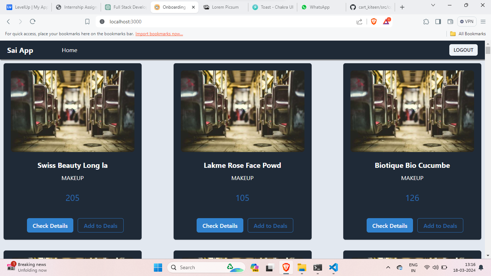
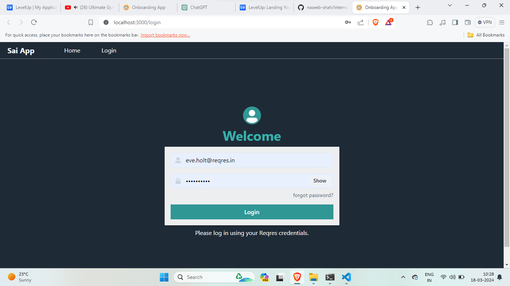
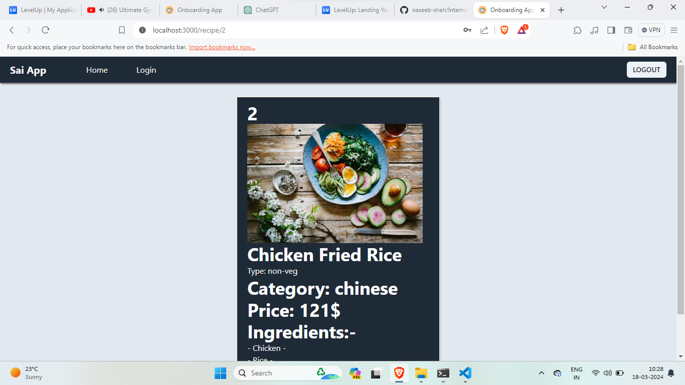

## Overview
This React project is designed for efficient user authentication using Reqres, while maintaining a sleek and intuitive user interface with Chakra UI. It leverages Axios for handling HTTP requests, Redux for centralized state management, and React Router DOM for seamless navigation between different components.








## Setup Instructions
1. **Clone the Repository**: 
   ```
   git clone <repository-url>
   ```
2. **Navigate to Project Directory**:
   ```
   cd <project-directory>
   ```
3. **Install Dependencies**:
   ```
   npm install
   ```
4. **Start Development Server**:
   ```
   npm start
   ```
   This will launch the application in your default web browser.

## Features
- **Authentication**: Users can log in using their Reqres credentials.
- **Styling**: The project utilizes Chakra UI for modern and responsive styling.
- **HTTP Requests**: Axios is employed for making HTTP requests to the Reqres API.
- **State Management**: Redux manages the application's state in a centralized manner.
- **Navigation**: React Router DOM enables smooth navigation between different pages of the application.

## Usage
1. **Login**: Navigate to the login page and enter your Reqres credentials.
2. **Explore**: Once logged in, explore the various features and functionalities of the application.
3. **Logout**: If applicable, include instructions for logging out or navigating back to the login page.

## Technologies Used
- **React**: JavaScript library for building user interfaces.
- **Chakra UI**: Modular and accessible component library for React applications.
- **Axios**: Promise-based HTTP client for making requests to server endpoints.
- **Redux**: Predictable state container for JavaScript applications.
- **React Router DOM**: Declarative routing library for React applications.

## Additional Notes
- Ensure a stable internet connection for seamless authentication using Reqres.
- For any questions, issues, or contributions, refer to the project's documentation or contact the project maintainers.

Feel free to customize this README to suit your project's specific requirements and add any additional sections or details as needed.